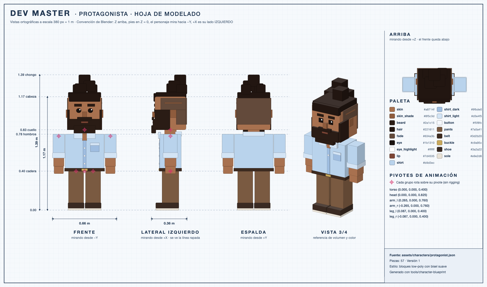

# Protagonista

> Estado: **borrador v1** · Nombre del personaje: *por definir*



## Concepto

El dev que domina la IA: seguro, concentrado y con estilo propio. Es el avatar del jugador: trabaja solo en su escritorio, camina a despertar empleados y aplasta bugs.

## Rasgos (tomados del referente visual)

| Rasgo | Del referente | Traducción a bloques |
|---|---|---|
| Cabello | Rizado oscuro, recogido arriba, lados rapados con una línea marcada | Tapa de cabello + 5 cubos biselados como chongo rizado, fade más claro a los lados y atrás, y línea rapada en el lado izquierdo |
| Barba | Completa y definida | Bloque frontal en la mandíbula, extensión de mentón, bigote y patillas que se unen al fade |
| Piel | Morena media | `skin` #a8714f, con `skin_shade` para nariz y orejas |
| Camisa | Azul claro de botones, mangas arremangadas | Torso azul con tira de botones, bolsillo izquierdo, cuello abierto y puños arremangados más claros |
| Pantalón | Café | Piernas cafés y cinturón con hebilla dorada |
| Zapatos | — | Tenis oscuros con suela clara |

## Proporciones

- **Altura:** 1.17 m hasta la cabeza; **1.39 m** con el chongo.
- **Cabeza grande** (0.34 m de lado, ~30% del cuerpo): proporciones de juguete, para que el personaje se lea bien desde la cámara lejana del juego.
- **Ancho total** con brazos: 0.66 m.

## Fuente de verdad

Las medidas exactas de las **57 piezas** (posición, tamaño, color, bisel y pivote) están en [`assets/characters/protagonist.json`](../../assets/characters/protagonist.json). La hoja de modelado se genera desde ese archivo:

```bash
node tools/character-blueprint/generate.mjs
```

Si cambias el JSON, vuelve a generar la hoja para que coincida.

## Instrucciones para modelar en Blender (vía MCP)

1. Leer `assets/characters/protagonist.json`. Convención: Z arriba, pies en Z = 0, el personaje mira hacia −Y y +X es su lado izquierdo.
2. Expandir las piezas con `"mirror": true` reflejándolas en X (sufijo `_l` → `_r`).
3. Crear cada pieza como un cubo con las coordenadas `min`/`max` exactas, aplicando el modificador **Bevel** cuando tenga `bevel`. Las piezas con `round` (ojos) se redondean al máximo.
4. Crear un material por color de la paleta (o una textura de paleta compartida, según [art-direction.md](../art-direction.md)), con sombreado plano o suave.
5. **Agrupar por `group`**: un objeto vacío (Empty) por grupo, ubicado en su `pivot` y con su jerarquía (`parent`). Cada pieza es hija de su grupo. Así Godot puede rotar cabeza, brazos y piernas sin rigging.
6. Aplicar transformaciones y unir las piezas de cada grupo en una sola malla por grupo (6 mallas en total).
7. Guardar como `assets/blender/protagonist.blend` y exportar a `assets/models/protagonist.glb` (glTF, +Y arriba).
8. Renderizar las vistas de frente, lateral y 3/4 para compararlas con la hoja de modelado.

## Pendiente

- [ ] Nombre del personaje.
- [ ] Revisar la cara: ojos, cejas y boca para los estados normal, concentrado, feliz y sorprendido.
- [ ] Variantes de color para los empleados (mismo cuerpo, distinto cabello y ropa).
